  

  
  
  
  

---

## What we build

Codic Systems builds the systems businesses are organised around — booking and
reservation platforms, operations and back-office software, and the AI workflows
that sit around them.

**Our specialism is travel.** Our founder runs a UK travel company, which means
we have been the business whose day stops when the booking system stops. We know
which parts of these platforms get built badly, because we have had to work
around them.

<table>
<tr>
<td width="33%" valign="top">

### 🧭 Booking platforms
Enquiry through to confirmation. Quoting, availability, payment, supplier and
fare API integration.

</td>
<td width="33%" valign="top">

### ⚙️ Operations systems
The back office a business actually runs on. Documents, invoicing, signatures,
reporting.

</td>
<td width="33%" valign="top">

### 🤖 AI workflows
Extraction, routing and automation. The model reads; a human owns any decision
that creates an obligation.

</td>
</tr>
</table>

---

## What's here

The client systems we build are private. What we publish is the part that is
useful to everyone else — tools, templates and reference material from real work.

| Repository | What it is |
|---|---|
| **[travel-whatsapp-booking-bot](https://github.com/codicsystems/travel-whatsapp-booking-bot)** | An n8n workflow that reads inbound WhatsApp travel enquiries, extracts what a consultant needs, replies to fill the gaps, and hands anything complex to a person. Verifies Meta's webhook signature — the step most tutorials skip, and the one that stops strangers sending messages in your company's name. |
| **[pk-it-export-toolkit](https://github.com/codicsystems/pk-it-export-toolkit)** | Templates and checklists for Pakistani companies invoicing clients abroad. Invoice template, purpose-code declaration, board resolution, agreement heads of terms, and the paperwork that decides how your export income is taxed. |
| **[redmoon-pdf](https://github.com/codicsystems/redmoon-pdf)** | Compress a PDF to an exact target size, in the browser. No upload, no server — binary search over quality and resolution, and it tells you honestly when the result would be worse than your original. |
| **[travel-tech-learning-path](https://github.com/codicsystems/travel-tech-learning-path)** | How travel booking and operations systems actually work, written for engineers about to build one. What a booking really is, where the money moves, and the failure modes that show up at 2am in month nine. |

---

<b>⚙️ How we work</b>

 

- **Scoped in writing before any code**, with an explicit list of what is *not* included
- **Architecture decision records** — one page per significant choice: what was decided, what was considered, why
- **Weekly increments you can open and click** — not a status report
- **Tested where being wrong costs money** — anything touching payments or bookings
- **A human review pass on every AI-generated module** — security boundaries, error handling, and anything the model may have invented
- **Handed over properly** — README, environment setup, deployment steps, credentials, architecture diagram, known limitations

Fixed price against a defined outcome. We do not bill hours.

You speak to the engineer building your system, not an account manager.

<b>🚫 Who we are not for</b>

 

Brochure websites, template work and WordPress theme customisation. That market
has been commoditised and we are not competing for it.

We will also tell you what not to build. Some of what people ask us for is not
worth doing, and saying so early is cheaper for everyone than finding out in
month four.

<b>🏛️ Verify us</b>

 

| | |
|---|---|
| **Registered name** | CODIC SYSTEMS (SMC-PRIVATE) LIMITED |
| **CUIN** | 0352637 — incorporated 27 August 2026, CRO Islamabad |
| **NTN** | J778998 · active filer |
| **PSEB** | Z-25-21973/26 — registered IT exporter |
| **Registered office** | Islamabad Capital Territory, Pakistan |

Search **CODIC SYSTEMS** on the
[SECP company register](https://eservices.secp.gov.pk/eServices/NameSearch.jsp).
We would rather you checked.

---

## Get in touch

Something to build, or a system that needs rescuing?

**[codicsystems.com](https://codicsystems.com)** · hello@codicsystems.com

  

